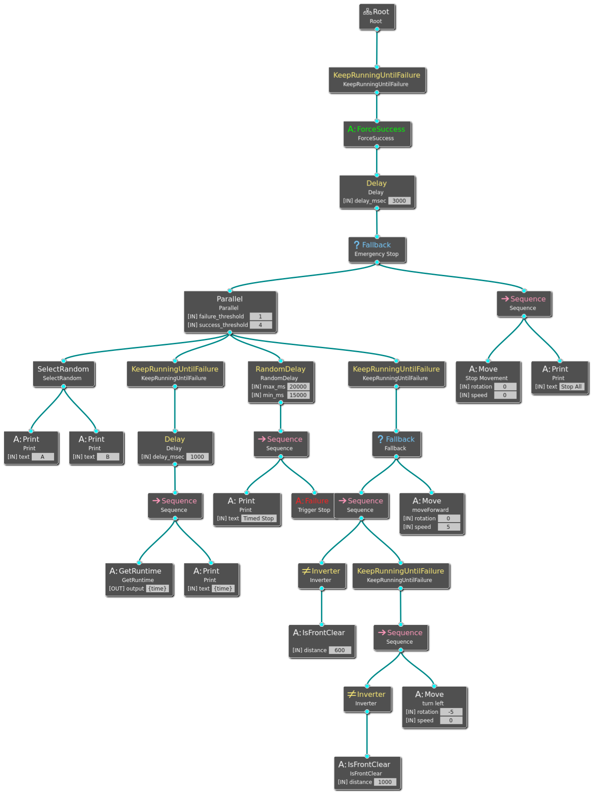
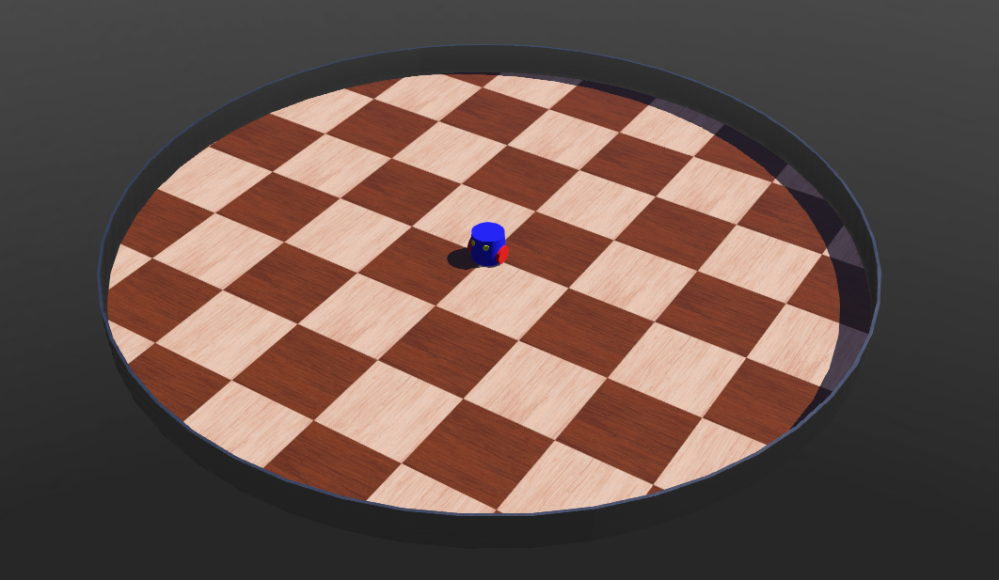
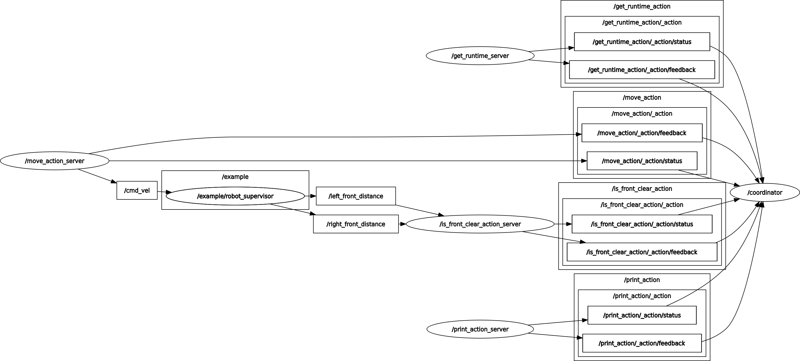

# btcpp-ros2-example

[](https://github.com/antonkesy/btcpp-ros2-example/actions)
[](https://opensource.org/licenses/MIT)

Simple [BTCPP v3.8](https://github.com/BehaviorTree/BehaviorTree.CPP/tree/v3.8) integration example using [ROS2 Humble](https://docs.ros.org/en/humble/index.html) and [Webots](https://cyberbotics.com/).

## Behavior

The basic behavior is:

- Endlessly drive forward
- If there is a obstacle in front: Turn left until it is clear again

Additionally:

- Every 15-20 seconds the behavior is interrupted, the robot stops, and restarts (with a 3 seconds delay)
- Every second the current runtime is outputted to the console using the BTCPP blackboard
- Randomly A or B is print at the start



## Simulation

The [Webots](https://cyberbotics.com/) simulation uses a two wheel robot with distance sensors stuck in a circle area.



### ROS2

BTCPP is connected with ROS2 using [nav2_behavior_tree](https://index.ros.org/p/nav2_behavior_tree/github-ros-planning-navigation2/)



## Running example

Docker and makefiles are used to run the example.
[dev container](https://code.visualstudio.com/docs/devcontainers/containers) and [VSCode Tasks](https://code.visualstudio.com/docs/editor/tasks) are also available.

### Perquisites

- Docker
- Webots (recommended to install outside container on native OS)

  - WINDOWS: add WEBOTS_GATEWAY to docker host (WSL) before starting container

  ```
  export WEBOTS_GATEWAY=`ip route show | grep -i default | awk '{ print $3}'`
  ```

### Make

In repository root:

- `make apt-nvidia-toolkit` -> Install nvidia-toolkit using apt for hardware acceleration
- `make build` -> build docker containers
- `make start` -> starts docker container
- `make build-nvidia start-nvidia` -> same but with nvidia-GPU connection
- `make connect` -> opens ssh connection to running container
- `make mount` -> mounts container workspace to `/` (helpful for LSPs)

Inside container/ros2_ws:

- `make bringup` -> starts example using ROS2 launch files
- `make clean` -> removes the `build`, `log` and `install` directories
- `make dependencies` -> pulls automatically all required dependencies
- `make build` -> build ROS2 workspace
- `make webots` -> starts Webots inside container (only recommended with GPU hardware acceleration)
- `make groot` -> build and starts BTCPP companion tool [Groot](https://github.com/BehaviorTree/Groot)

## Starting

1. `make build start` to start container
2. `make build` inside container
3. Start Webots (natively or `make webots`) and open `./ros2_ws/src/webots/worlds/test_world.wbt`
4. Optionally start `make groot &` in the background to live monitor behavior tree
5. `make bringup` to start example behavior tree `./ros2_ws/src/coordinator/trees/example_main.xml`

## Fix Common Issues

### Cannot connect to Webots

- Check if `1234` Port matches in Webots terminal output: `INFO: 'my_robot' extern controller: disconnected, waiting for new connection.`
- Ping open Webots from within container using `nc -zv <IP> 1234` -> This should not fail!
  - Windows-IP: echo $WEBOTS_GATEWAY
  - Linux: localhost

### No display within docker

```
qt.qpa.xcb: could not connect to display :0
qt.qpa.plugin: Could not load the Qt platform plugin "xcb" in "" even though it was found.
<OR>
could not connect to display :0
This application failed to start because no Qt platform plugin could be initialized. Reinstalling the application may fix this problem.
```

Currently only X11 is supported!

Possible Solutions:

- Clear compose-container
- Check display env
- [Run Linux GUI apps on WSL](https://learn.microsoft.com/en-us/windows/wsl/tutorials/gui-apps)
- Run container using `make start` instead of VSCode dev-container
- Rebuild docker image

### action client implementation is invalid

```
[behavior_tree_runner-9] [ERROR] [1703273216.045613649] [behavior_tree_runner.rclcpp_action]: Error in destruction of rcl action client handle: action client implementation is invalid, at ./src/rcl_action/action_client.c:472
[behavior_tree_runner-9] could not initialize rcl action client: failed to get goal service name, at ./src/rcl_action/action_client.c:217
```

- Make sure the executed behavior tree does not contain `input_port` : `server_name` or `server_timeout` -> manually remove them

```
<Action ID="ActionName">
            <input_port name="server_name" type="std::string">Action server name</input_port>
            <input_port name="server_timeout" type="std::chrono::duration&lt;long, std::ratio&lt;1l, 1000l&gt; &gt;"/>
            <input_port name="otherPort" type="std::string"/>
</Action>
```

### Error response from daemon: could not select device driver "nvidia" with capabilities: [[gpu]]

- nvidia GPU connected?
- Up-to-date driver installed?
- nvidia-toolkit installed? -> `sudo make apt-nvidia-toolkit` (might require reboot)

### No permission to change files

Binding docker to a local volume can overwrite existing permissions ...

```
chown -R $USER ./taco_ws
```

### WSL Freezes while compiling

As of Feb 2024, WSL2 has sometimes problems with multiprocessing.

For compiling set [the amount of parallel jobs to 1 as a workaround](https://stackoverflow.com/questions/36633074/set-the-number-of-threads-in-a-cmake-build) in the ros2_ws makefile

```
--parallel 1
```

### Long dependencies loading every time docker is started

The docker image only has the dependencies from the date of its creation.
If there are newer version, it has to pull them at each start.

Building the image again fixes this.

### CMake: Could not find a package configuration file

```
CMake Error at CMakeLists.txt:13 (find_package):
  By not providing "Findbehaviortree_cpp_v3.cmake" in CMAKE_MODULE_PATH this
  project has asked CMake to find a package configuration file provided by
  "behaviortree_cpp_v3", but CMake did not find one.

  Could not find a package configuration file provided by
  "behaviortree_cpp_v3" with any of the following names:

    behaviortree_cpp_v3Config.cmake
    behaviortree_cpp_v3-config.cmake

  Add the installation prefix of "behaviortree_cpp_v3" to CMAKE_PREFIX_PATH
  or set "behaviortree_cpp_v3_DIR" to a directory containing one of the above
  files.  If "behaviortree_cpp_v3" provides a separate development package or
  SDK, be sure it has been installed.
```

- run `make dependencies`

### Bringup not found

```
Package 'bringup' not found: "package 'bringup' not found, searching: ['/opt/ros/humble']"
```

- have you ran `make build` after `make clean`?

### unknown result response, ignoring...

```
[coordinator-5] [ERROR] [1709157138.311516705] [coordinator.rclcpp_action]: unknown result response, ignoring...
```

- `make clean build` in container and restart container
- (sourcing could be enough but just to be sure)
